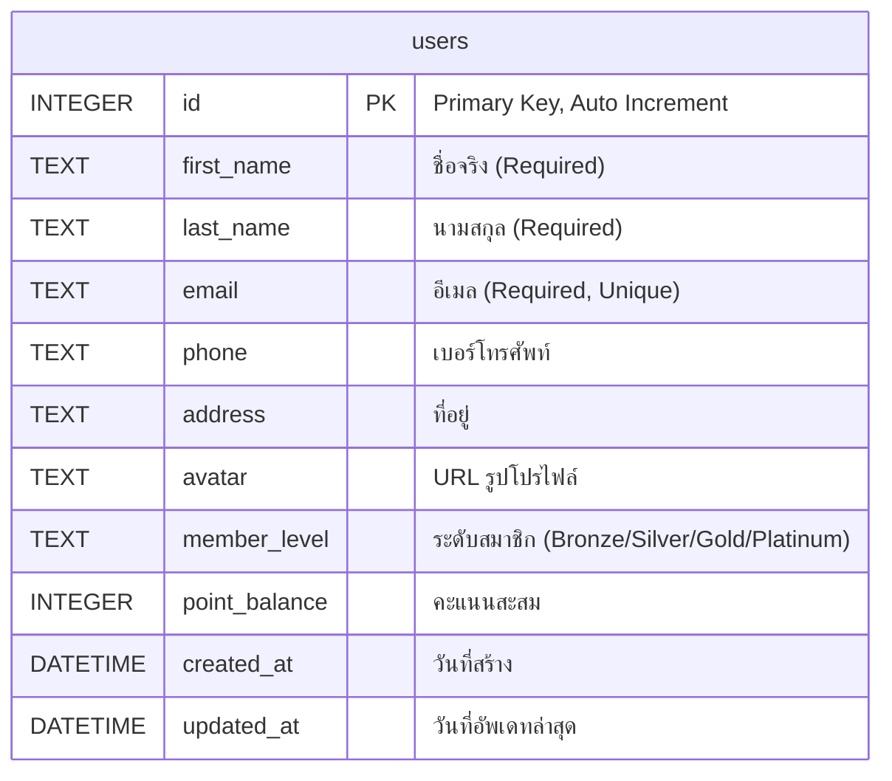

# Database Schema Documentation

## Overview

โปรเจค Workshop 4 ใช้ SQLite database สำหรับจัดเก็บข้อมูล โดยมี schema ดังนี้:

## ER Diagram



## Table Details

### Users Table

ตาราง `users` เก็บข้อมูลผู้ใช้ทั้งหมดในระบบ

| Column | Type | Constraints | Description |
|--------|------|-------------|-------------|
| `id` | INTEGER | PRIMARY KEY, AUTOINCREMENT | รหัสผู้ใช้ (Auto-generated) |
| `first_name` | TEXT | NOT NULL | ชื่อจริงของผู้ใช้ |
| `last_name` | TEXT | NOT NULL | นามสกุลของผู้ใช้ |
| `email` | TEXT | NOT NULL, UNIQUE | อีเมลของผู้ใช้ (ต้องไม่ซ้ำ) |
| `phone` | TEXT | - | เบอร์โทรศัพท์ติดต่อ |
| `address` | TEXT | - | ที่อยู่ของผู้ใช้ |
| `avatar` | TEXT | - | URL ของรูปโปรไฟล์ |
| `member_level` | TEXT | DEFAULT 'Bronze' | ระดับสมาชิก (Bronze, Silver, Gold, Platinum) |
| `point_balance` | INTEGER | DEFAULT 0 | คะแนนสะสมของผู้ใช้ |
| `created_at` | DATETIME | NOT NULL | วันเวลาที่สร้างข้อมูล |
| `updated_at` | DATETIME | NOT NULL | วันเวลาที่อัพเดทข้อมูลล่าสุด |

## Indexes

```sql
CREATE UNIQUE INDEX idx_users_email ON users(email);
```

- **idx_users_email**: Index สำหรับค้นหาอีเมลแบบ unique เพื่อเพิ่มความเร็วในการตรวจสอบอีเมลซ้ำ

## Business Rules

### User Validation Rules

1. **First Name**: ต้องไม่เป็นค่าว่าง
2. **Last Name**: ต้องไม่เป็นค่าว่าง
3. **Email**: ต้องไม่เป็นค่าว่างและต้องไม่ซ้ำกับผู้ใช้อื่น
4. **Member Level**: มี 4 ระดับ - Bronze (default), Silver, Gold, Platinum
5. **Point Balance**: เริ่มต้นที่ 0 คะแนน

### Default Values

- `member_level`: "Bronze" (สำหรับผู้ใช้ใหม่)
- `point_balance`: 0 (สำหรับผู้ใช้ใหม่)

## Database File

- **File**: `users.db`
- **Type**: SQLite3
- **Location**: Root directory ของโปรเจค

## Sample Data

```json
{
  "id": 1,
  "first_name": "John",
  "last_name": "Doe",
  "email": "john@example.com",
  "phone": "1234567890",
  "address": "123 Main St",
  "avatar": "",
  "member_level": "Bronze",
  "point_balance": 0,
  "created_at": "2025-11-10T14:14:24+07:00",
  "updated_at": "2025-11-10T14:14:24+07:00"
}
```

## Database Initialization

Database จะถูกสร้างอัตโนมัติเมื่อ:
1. Application เริ่มทำงาน
2. ไฟล์ `users.db` ยังไม่มีอยู่

SQL สำหรับสร้างตาราง:

```sql
CREATE TABLE IF NOT EXISTS users (
    id INTEGER PRIMARY KEY AUTOINCREMENT,
    first_name TEXT NOT NULL,
    last_name TEXT NOT NULL,
    email TEXT NOT NULL UNIQUE,
    phone TEXT,
    address TEXT,
    avatar TEXT,
    member_level TEXT DEFAULT 'Bronze',
    point_balance INTEGER DEFAULT 0,
    created_at DATETIME NOT NULL,
    updated_at DATETIME NOT NULL
)
```

## Migration History

| Version | Date | Description |
|---------|------|-------------|
| 1.0 | 2025-11-10 | Initial schema with users table |

## Related Files

- `database/db.go` - Database initialization และ connection management
- `internal/domain/user.go` - User entity definition
- `internal/infrastructure/repository/user_repository.go` - Database operations implementation
